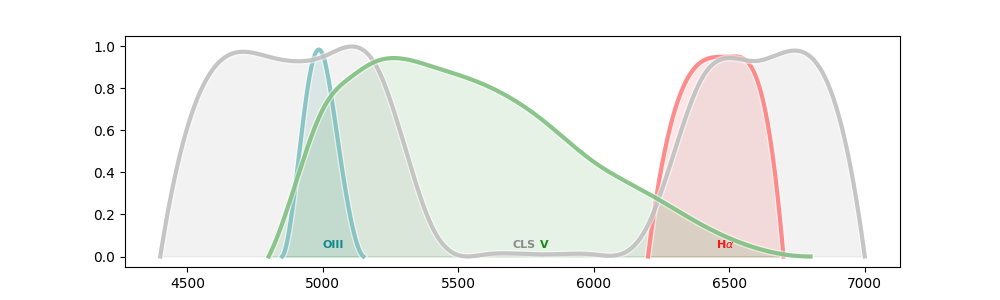

## Filters
Filters for astronomy packages

[](http://www.astropy.org/) 

## Prerequisite
  - Astropy

## Authors and Contributors

<table><tbody>
<tr><th align="left">Dominique Touzan</th><td><a href="https://github.com/dtouzan/ciboulette">GitHub/dtouzan</a></td><td><a href="http://twitter.com/dominiquetouzan">Twitter/@dominiquetouzan</a></td></tr>
</tbody></table>

## License

Under the MIT license. See the included [LICENSE.md](./LICENSE.md) file for more details.

## Example

#### Existing filter

- SDSS : SDSS_sloan_g, SDSS_sloan_r, sdss_sloan_u, SDSS_sloan_i, SDSS_sloan_z_s, -SDSS_sloan_y
- BESSEL : BESSEL_v, BESSEL_b, BESSEL_r, BESSEL_u, BESSEL_i
- RGB : RGB_r, RGB_g, RGB_b
- H$$\alpha$ : HA35nm
- CLS : CLS_ccd
- OIII : OIII12nm

```python
# Read modules
from matplotlib import pyplot as plt
from ciboulette.filtering import filters

# Create filter 
f = filters.Filters(filters.OIII12nm)

# Edit filter values
f.name, f.label, f.color
('Astronomik OIII CCD 12nm', 'OIII', 'teal')
f.spectral_axis, f.flux
([4850, 4900, 4950, 5000, 5050, 5100, 5150], [0, 0.35, 0.85, 0.96, 0.6, 0.2, 0])
f.max_flux
0.96
f.max_spectral_axis
5150

# Filters constant
filters.SDSS_sloan_r['name']
"Baader SLOAN/SDSS r' photometric"

filters.HA35nm['flux']
[0, 0.7, 0.95, 0.85, 0]

# Dictionary
filters_dict = {'sdssG': filters.SDSS_sloan_g, 'sdssR': filters.SDSS_sloan_r, 3: f}
getattr(filters_dict[3], 'name'), filters_dict[3].label
('Astronomik OIII CCD 12nm', 'OIII')

# Create
OIII = filters.Filters(filters.OIII12nm)
Ha = filters.Filters(filters.HA35nm)
CLS = filters.Filters(filters.CLS_ccd)
Bessel_v = filters.Filters(filters.BESSEL_v)

# Plot
figure = plt.figure(figsize=(10, 3))
axis = figure.subplots(1, 1)
OIII.axis = Ha.axis = CLS.axis = Bessel_v.axis = axis
OIII.plot()
Ha.plot()
CLS.plot()
Bessel_v.plot()
plt.savefig('Filters.png')
plt.show()
```



