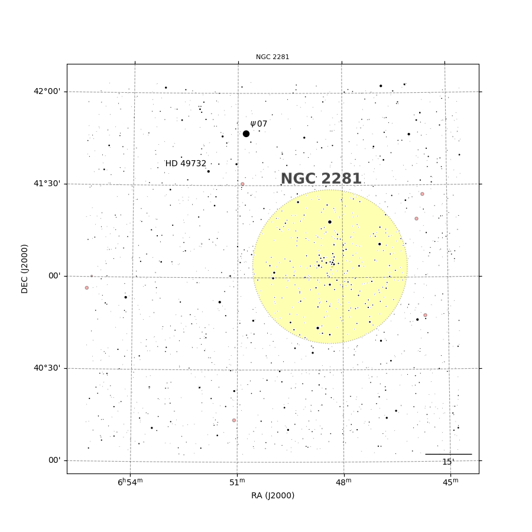

## Map
Map for astronomy packages

[](http://www.astropy.org/) 

## Prerequisite
  - Astropy
  - Astroquery

## Authors and Contributors

<table><tbody>
<tr><th align="left">Dominique Touzan</th><td><a href="https://github.com/dtouzan/ciboulette">GitHub/dtouzan</a></td><td><a href="http://twitter.com/dominiquetouzan">Twitter/@dominiquetouzan</a></td></tr>
</tbody></table>

## License

Under the MIT license. See the included [LICENSE.md](./LICENSE.md) file for more details.

## Exemple
```python
# Read module
from ciboulette.sector.maps import Map
from matplotlib import pyplot as plt

# Create map (imx477 and Samyang 85mm data)
MyMap = Map()
data_wcs = {'RA':6+(50/60), 
	'DEC': 41+(3/60), 
	'naxis1': 4000, 
	'naxis2': 3000, 
	'binXY': 1, 
	'pixelXY': 1.55, 
	'focal': 85, 
	'projection': 'TAN'}
MyMap.new(data_wcs)

# Read DSO
MyMap.opencluster()
MyMap.globularcluster()
MyMap.planetarynebula()
MyMap.brightnebula()
MyMap.galaxy()

# Read Gaia edr3
MyMap.gaiaedr3()

# Create label Psi07 
dataset = {'ra': 6+(50.55/60), 'dec': 41+(50/60), 'angle': 0, 'main_id': "psi"}
MyMap.s(dataset)
dataset = {'ra': 6+(50.30/60), 'dec': 41+(50/60), 'angle': 0, 'main_id': "07"}
MyMap.label(dataset)

# Create label HD 49732
dataset = {'ra': 6+(52.50/60), 'dec': 41+(37/60), 'angle': 0, 'main_id': "HD 49732"}
MyMap.label(dataset)

# Create label NGC 2281
dataset = {'ra': 6+(48.60/60), 'dec': 41+(32/60), 'angle': 0, 'main_id': "NGC 2281"}
style = {'color': 'black', 'size': 18, 'angle': 0, 'alpha':0.6}
MyMap.LABEL(dataset, style)

# Create plot
fig = plt.figure(figsize=(9,9))
ax = fig.add_subplot(111, projection=MyMap.WCS)
MyMap.title = 'NGC 2281'
MyMap.plot(ax)
MyMap.minutes(ax, 15) # scale
MyMap.J2000(ax) # legende
MyMap.titlemap(ax)
plt.show()
```

```python
MyMap.catalogs
['Simbad.CDS open cluster',  'Simbad.CDS galaxy',  'gaia edr3.CDS.I/350/gaiaedr3',  'label']
 
MyMap.view(['Simbad.CDS open cluster',]) 
Table 1: Simbad.CDS open cluster
 MAIN_ID      RA        DEC       OTYPE    FLUX_G FLUX_V SP_TYPE     COO_BIBCODE    
           "h:m:s"    "d:m:s"               mag    mag                              
--------- ---------- --------- ----------- ------ ------ ------- -------------------
NGC  2281 06 48 21.8 +41 03 36 OpenCluster     --    5.4         2021A&A...647A..19T
 OCSN 228    06 48.3    +41 04 OpenCluster     --     --         2023ApJS..265...12Q
 
MyMap.catalog('Simbad.CDS open cluster')
Table length=2
MAIN_ID	RA	DEC	RA_PREC	DEC_PREC	COO_ERR_MAJA	COO_ERR_MINA	COO_ERR_ANGLE	COO_QUAL	COO_WAVELENGTH	COO_BIBCODE	GALDIM_MAJAXIS	GALDIM_MINAXIS	GALDIM_ANGLE	GALDIM_QUAL	GALDIM_WAVELENGTH	GALDIM_BIBCODE	FLUX_G	FLUX_V	FLUX_B	OTYPE	SP_TYPE	SP_QUAL	SP_BIBCODE	SCRIPT_NUMBER_ID
"h:m:s"	"d:m:s"			mas	mas	deg				arcmin	arcmin	deg				mag	mag	mag					
object	str13	str13	int16	int16	float32	float32	int16	str1	str1	object	float32	float32	int16	str1	str1	object	float32	float32	float32	object	object	str1	object	int32
NGC 2281	06 48 21.8	+41 03 36	5	5	--	--	0	D	O	2021A&A...647A..19T	50.0	50.0	0	D	O	2020A&A...633A..99C	--	5.4	6.05	OpenCluster				0
OCSN 228	06 48.3	+41 04	3	3	--	--	0	E	O	2023ApJS..265...12Q	--	--	0				--	--	--	OpenCluster				0
```