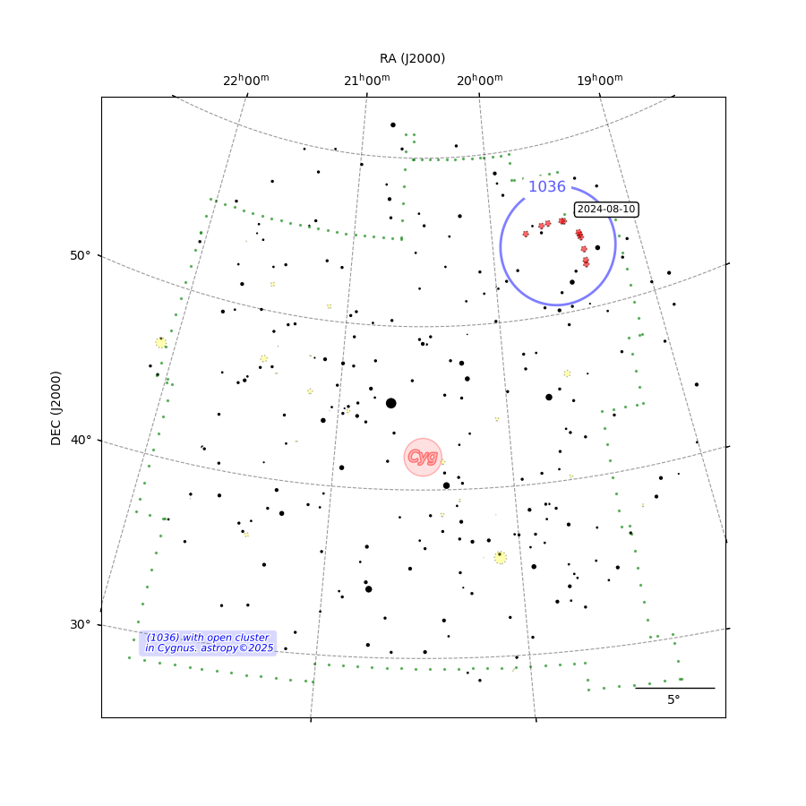

## Map
Map for astronomy packages

[](http://www.astropy.org/) 

## Prerequisite
  - Astropy
  - Astroquery 0.4.7 (New 0.4.8 in dev)

## Authors and Contributors

<table><tbody>
<tr><th align="left">Dominique Touzan</th><td><a href="https://github.com/dtouzan/ciboulette">GitHub/dtouzan</a></td><td><a href="http://twitter.com/dominiquetouzan">Twitter/@dominiquetouzan</a></td></tr>
</tbody></table>

## License

Under the MIT license. See the included [LICENSE.md](./LICENSE.md) file for more details.

## Exemple
```python
# Read module
from ciboulette.sector.maps import Map
from matplotlib import pyplot as plt

# Create map (imx477 and Samyang 85mm data)
MyMap = Map()
data_wcs = {'RA':6+(50/60), 
	'DEC': 41+(3/60), 
	'naxis1': 4000, 
	'naxis2': 3000, 
	'binXY': 1, 
	'pixelXY': 1.55, 
	'focal': 85, 
	'projection': 'TAN'}
MyMap.new(data_wcs)

# Read DSO
MyMap.opencluster()
MyMap.globularcluster()
MyMap.planetarynebula()
MyMap.brightnebula()
MyMap.galaxy()

# Read Gaia edr3
MyMap.gaiaedr3()

# Create label Psi07 
dataset = {'ra': 6+(50.55/60), 'dec': 41+(50/60), 'angle': 0, 'main_id': "psi"}
MyMap.s(dataset)
dataset = {'ra': 6+(50.30/60), 'dec': 41+(50/60), 'angle': 0, 'main_id': "07"}
MyMap.label(dataset)

# Create label HD 49732
dataset = {'ra': 6+(52.50/60), 'dec': 41+(37/60), 'angle': 0, 'main_id': "HD 49732"}
MyMap.label(dataset)

# Create label NGC 2281
dataset = {'ra': 6+(48.60/60), 'dec': 41+(32/60), 'angle': 0, 'main_id': "NGC 2281"}
style = {'color': 'black', 'size': 18, 'angle': 0, 'alpha':0.6}
MyMap.LABEL(dataset, style)

# Create plot
fig = plt.figure(figsize=(9,9))
ax = fig.add_subplot(111, projection=MyMap.WCS)
MyMap.title = 'NGC 2281'
MyMap.plot(ax)
MyMap.minutes(ax, 15) # scale
MyMap.J2000(ax) # legende
MyMap.titlemap(ax)
plt.show()
```

```python
# Read data catalogs
MyMap.catalogs
['Simbad.CDS open cluster',  'Simbad.CDS galaxy',  'gaia edr3.CDS.I/350/gaiaedr3',  'label']
 
MyMap.view(['Simbad.CDS open cluster',]) 
Table 1: Simbad.CDS open cluster
 MAIN_ID      RA        DEC       OTYPE    FLUX_G FLUX_V SP_TYPE     COO_BIBCODE    
           "h:m:s"    "d:m:s"               mag    mag                              
--------- ---------- --------- ----------- ------ ------ ------- -------------------
NGC  2281 06 48 21.8 +41 03 36 OpenCluster     --    5.4         2021A&A...647A..19T
 OCSN 228    06 48.3    +41 04 OpenCluster     --     --         2023ApJS..265...12Q
 
MyMap.catalog('Simbad.CDS open cluster') # View Table Astropy type
```

## Exemple with labels and markers
```python
# Read module
from ciboulette.sector.maps import Map
from matplotlib import pyplot as plt

# Create map (imx477 and Samyang 85mm data)
MyMap = Map()
data_wcs = {'RA': 20.50, 'DEC': 45, 'naxis1': 4000, 'naxis2': 3000, 'binXY': 1, 'pixelXY': 7, 'focal': 35, 'projection': 'TAN'}
MyMap.new(data_wcs)

# Read stars Simbad CDS, light = magnitude 6
MyMap.light
MyMap.stars()

# Create markers
data = [['2024-08-01T21:03:00', '1036-20240801-2103-9x60s-f85.fits', 290.72333333333336, 52.595, 53, 1500, 5000],
        ['2024-08-02T20:56:00', '1036-20240802-2056-18x60s-f85.fits', 290.6895833333333, 52.83555555555556, 53, 1800, 5000],
        ['2024-08-05T20:43:00', '1036-20240805-2043-30x60s-f85.fits', 290.63958333333335, 53.49388888888889, 53, 1500, 5000],
        ['2024-08-09T20:42:00', '1036-20240809-2042-30x60s-f85.fits', 290.72041666666667, 54.22583333333333, 53, 1000, 4000],
        ['2024-08-10T20:43:00', '1036-20240810-2043-29x60s-f85.fits', 290.77166666666665, 54.3825, 53, 1000, 4000],
        ['2024-08-11T20:42:00', '1036-20240811-2042-33x60s-f85.fits', 290.83624999999995, 54.52833333333333, 53, 800, 4000],
        ['2024-08-20T20:49:00', '1036-20240820-2049-25x60s-f85.fits', 292.13083333333327, 55.37111111111111, 53, 2000, 6500],
        ['2024-08-21T20:39:00', '1036-20240821-2039-30x60s-f85.fits', 292.3620833333333, 55.41111111111111, 53, 1800, 6500],
        ['2024-08-26T20:34:00', '1036-20240826-2034-30x60s-f85.fits', 293.8320833333333, 55.44277777777778, 53,800, 5000],
        ['2024-08-28T19:56:00', '1036-20240828-1956-50x60s-f85.fits', 294.56291666666664, 55.37277777777778, 53, 1000, 6000],
        ['2024-09-01T20:23:00', '1036-20240901-2023-6x60s-f85.fits', 296.3374999999999, 55.07444444444445, 53, 800, 6000]]

for line in data:
    data_base = {'ra': line[2]/15, 'dec': line[3], 'angle': 20, 'main_id': line[0]}
    style = {'color': 'red', 'size': 1, 'alpha': 0.6}
    MyMap.marker(data_base, style)

# Create label date 
dataset = {'ra': 19+(10/60), 'dec': data[6][3], 'angle': 0, 'main_id': "2024-08-10"}
style = {'color': 'black', 'size': 8, 'angle': 0, 'alpha':1}
MyMap.date(dataset, style)

# Create label red pin 
dataset = {'ra': 20+(30/60), 'dec': 42, 'angle': 0, 'main_id': "Cyg"}
style = {'color': 'black', 'size': 12, 'angle': 0, 'alpha':0.5}
MyMap.red(dataset, style)

# Create label information
dataset = {'ra': 21+(30/60), 'dec': 30, 'angle': 0, 'main_id': "(1036) with open cluster\n in Cygnus. astropy©2025"}
MyMap.i(dataset)

# Create label blue pin 
dataset = {'ra': 19+(33/60), 'dec': 54, 'angle': 420, 'main_id': "1036"}
MyMap.blue(dataset, style)

# Plot map and save PNG format 
fig = plt.figure(figsize=(9,9))
ax = fig.add_subplot(111, projection=MyMap.WCS)
MyMap.plot(ax)
MyMap.J2000(ax)
MyMap.degree(ax,5)
plt.savefig('Ganymed.png')
plt.show()
```

```python
# Read data catalogs
MyMap.catalogs
['Simbad.CDS stars', 'CYG', 'Simbad.CDS open cluster', 'marker', 'label']

MyMap.view(['Simbad.CDS open cluster', 'Simbad.CDS stars'])
Table 1: Simbad.CDS open cluster
     MAIN_ID          RA        DEC       OTYPE    FLUX_G FLUX_V SP_TYPE     COO_BIBCODE    
                   "h:m:s"    "d:m:s"               mag    mag                              
----------------- ---------- --------- ----------- ------ ------ ------- -------------------
        NGC  7209 22 04 53.8 +46 30 29 OpenCluster     --    7.7         2021A&A...647A..19T
        NGC  7044 21 13 08.2 +42 29 38 OpenCluster     --   12.0         2021A&A...647A..19T
        NGC  6997 20 56 30.7 +44 38 24 OpenCluster     --   10.0         2021A&A...647A..19T
Cl Collinder  428   21 03 04  +44 33.6 OpenCluster     --    8.7         2013A&A...558A..53K
        NGC  7062 21 23 26.9 +46 23 06 OpenCluster     --    8.3         2021A&A...647A..19T
          IC 1369 21 12 07.9 +47 46 12 OpenCluster     --    8.8         2021A&A...647A..19T
        NGC  7039 21 10 39.1 +45 35 49 OpenCluster     --    7.6         2021A&A...647A..19T
        NGC  7067 21 24 13.9 +48 00 43 OpenCluster     --    9.7         2021A&A...647A..19T
        NGC  7082 21 28 44.6 +47 06 11 OpenCluster     --    7.2         2021A&A...647A..19T
Cl Collinder  421 20 23 19.0 +41 42 04 OpenCluster     --   10.1         2021A&A...647A..19T
        NGC  7086 21 30 29.8 +51 35 35 OpenCluster     --    8.4         2021A&A...647A..19T
        NGC  7128 21 43 57.8 +53 42 54 OpenCluster     --    9.7         2021A&A...647A..19T
        NGC  7031 21 07 14.2 +50 52 12 OpenCluster     --    9.1         2021A&A...647A..19T
        NGC  6866 20 03 55.9 +44 09 29 OpenCluster     --    7.6         2021A&A...647A..19T
        NGC  6811 19 37 21.6 +46 22 41 OpenCluster     --    6.8         2021A&A...647A..19T
        NGC  7063 21 24 29.3 +36 30 25 OpenCluster     --    7.0         2021A&A...647A..19T
  Cl Roslund    4   20 04 48  +29 11.8 OpenCluster     --   10.0         2020A&A...633A..99C
        NGC  6791 19 20 53.0 +37 46 41 OpenCluster     --    9.5         2021A&A...647A..19T
        NGC  6871 20 06 11.5 +35 45 54 OpenCluster     --    5.2         2021A&A...647A..19T
        NGC  6883   20 11 19  +35 49.9 OpenCluster     --    8.0         2009MNRAS.399.2146W
        NGC  6819 19 41 18.5 +40 11 24 OpenCluster     --    7.3         2021A&A...647A..19T
    Cl Basel    6   20 06 42  +38 21.9 OpenCluster     --    7.7         2013A&A...558A..53K
      Cl VDB  130   20 18 00  +39 19.8 OpenCluster     --    9.3         2002A&A...392..869L
            M  29   20 23 46  +38 29.2 OpenCluster     --    6.6         2020A&A...633A..99C

Table 2: Simbad.CDS stars
  MAIN_ID          RA           DEC              OTYPE           FLUX_G  FLUX_V     SP_TYPE          COO_BIBCODE    
                "h:m:s"       "d:m:s"                             mag     mag                                       
------------ ------------- ------------- ---------------------- -------- ------ ---------------- -------------------
   HD 200253 21 01 12.8647 +36 01 33.642                   Star  5.76347  5.997            G5III 2020yCat.1350....0G
 *  61 Cyg B 21 06 55.2638 +38 44 31.358                HighPM* 5.450645   6.03              K7V 2020yCat.1350....0G
   * tau Cyg 21 14 47.4925 +38 02 43.144               delSctV*  3.70454   3.73             F2IV 2007A&A...474..653V
 *  61 Cyg A 21 06 53.9395 +38 44 57.902                BYDraV* 4.766713   5.21              K5V 2020yCat.1350....0G
   * sig Cyg 21 17 24.9522 +39 23 40.847                 BlueSG 4.179437   4.24            B9Iab 2020yCat.1350....0G
V* V1334 Cyg 21 19 22.1791 +38 14 14.868           ClassicalCep 5.724996  5.882       F1II+B7.0V 2020yCat.1350....0G
   *  74 Cyg 21 36 56.9752 +40 24 48.692                   Star 4.979593  5.035             A3Vn 2020yCat.1350....0G
   HD 206749 21 43 06.4713 +41 09 17.902              Variable* 4.719647  5.505        M2IIIbCa1 2020yCat.1350....0G
   *  77 Cyg 21 42 22.9588 +41 04 37.273                    SB* 5.984918  5.726          A0V+A0V 2007A&A...474..653V
   HD 200465 21 02 20.9580 +39 30 32.518                   Star 5.934489   6.44            K3III 2020yCat.1350....0G
   HD 200577 21 03 04.8395 +38 39 26.689                   Star 5.850463  6.097            G8III 2020yCat.1350....0G
   HD 202720 21 16 29.6185 +42 15 06.444                   Star 5.856757   6.21               K2 2020yCat.1350....0G
V* V1070 Cyg 21 22 48.6042 +40 55 57.180           LongPeriodV* 4.655952  7.155            M7III 2020yCat.1350....0G
   *  75 Cyg 21 40 11.1100 +43 16 25.815                     ** 4.358688  5.086          M1IIIab 2020yCat.1350....0G

      ...        ...           ...                 ...             ...     ...       ...               ...
	  
     * P Cyg 20 17 47.2019 +38 01 58.549                 BlueSG 4.566381   4.82       B1-2Ia-0ep 2020yCat.1350....0G
   *  36 Cyg 20 18 28.6552 +36 59 59.295                   Star  5.57188   5.58              A2V 2020yCat.1350....0G
   *  40 Cyg 20 27 34.2590 +38 26 25.262                HighPM* 5.626205   5.62              A3V 2020yCat.1350....0G
   *  44 Cyg 20 30 59.2290 +36 56 09.023                   Star 5.879742  6.216             F5Ib 2020yCat.1350....0G
   *  42 Cyg 20 29 20.3901 +36 27 17.017              post-AGB* 5.739101  5.899         A2Iab-Ib 2020yCat.1350....0G
   * lam Cyg 20 47 24.5376 +36 29 26.573                     **       --   4.54              B5V 2007A&A...474..653V
    V* T Cyg 20 47 10.7523 +34 22 26.841 LongPeriodV*_Candidate 4.514234   4.93            K3III 2020yCat.1350....0G
   HD 198437 20 49 12.0624 +35 33 48.836              Variable* 5.856268   6.65               K5 2020yCat.1350....0G
   HD 199251 20 54 57.7282 +33 45 50.423              Variable* 5.859844   6.93               M4 2020yCat.1350....0G
   HD 199101 20 53 53.8916 +33 26 16.413                   Star 4.869454   5.47            K5III 2020yCat.1350....0G
   *  31 Cyg 20 13 37.9082 +46 44 28.761                    SB* 3.282255    3.8      K3Ib+B2IV-V 2020yCat.1350....0G
  HD 209515A 22 02 56.6607 +44 38 59.500                   Star 5.712503  5.715                  2020yCat.1350....0G
  HD 201433A 21 08 38.8897 +30 12 20.287                    SB* 5.718819   5.71          B9VspSi 2020yCat.1350....0G
 * lam Cyg A 20 47 24.5315 +36 29 26.499                     ** 4.712803   4.76                  2020yCat.1350....0G
  HD 199955A 20 58 30.0335 +50 27 42.450                   Star 5.950958   5.96            B7IVn 2020yCat.1350....0G
