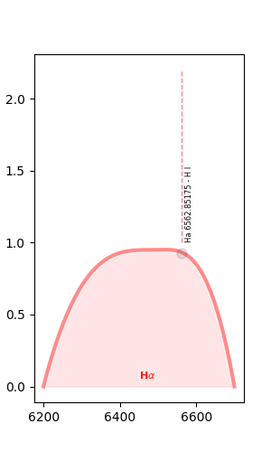
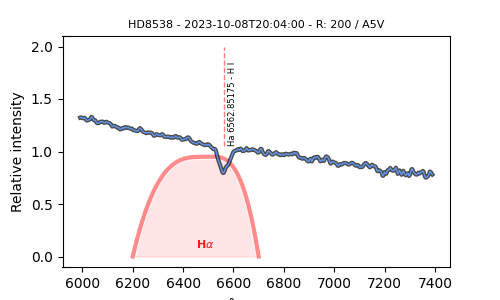

## Spectrum
Spectrum for astronomy packages

[](http://www.astropy.org/) 

## Prerequisite
  - Astropy
  - Specutils

## Authors and Contributors

<table><tbody>
<tr><th align="left">Dominique Touzan</th><td><a href="https://github.com/dtouzan/ciboulette">GitHub/dtouzan</a></td><td><a href="http://twitter.com/dominiquetouzan">Twitter/@dominiquetouzan</a></td></tr>
</tbody></table>

## License

Under the MIT license. See the included [LICENSE.md](./LICENSE.md) file for more details.

## Example

```python
# Read module
from ciboulette.spectrum import atomiclines, line

# Citation
print(atomiclines.__citation__)
Kramida, A., Ralchenko, Yu., Reader, J. and NIST ASD Team (2022) ]. Available: https://physics.nist.gov/PhysRefData/ASD/index.html#Team.
NIST Atomic Spectra Database (version 5.10), [Online]. Available: https://physics.nist.gov/asd [Thu Nov 09 2023].
National Institute of Standards and Technology, Gaithersburg, MD. DOI: https://doi.org/10.18434/T4W30F

# Create line
line_Ha = line.lines(line.AtomicLine_C)

# Atomic line
line_Ha.wavelength
656.285175

line_Ha.spectrum
'H I'

# Name & label
line_Ha.name, line_Ha.label

# Line of atomic lines
Atomiclines.lambda_min = 656.28
Atomiclines.lambda_max = 656.3
Atomiclines.spectrum = 'H I'

# line(s) table
Atomiclines.request.pprint(max_width=255,max_lines=10)
Wavelength Rel    Aki     Acc               Ei - Ek               L Conf L Term L J U Conf U Term U J gi - gk Type   TP   Line Spectrum
---------- --- ---------- --- ----------------------------------- ------ ------ --- ------ ------ --- ------- ---- ----- ----- --------
656.285175  -- 64651000.0 AAA 82259.2850014     -    97492.355566     2p    2P* 3/2     3d     2D 5/2   4 - 6   -- T7771 L2752      H I

# Get values
Atomiclines.get('','')
{'name': '',
 'label': '',
 'wavelength': '656.285175',
 'spectrum': np.str_('H I')}

# get spectrum
str(Atomiclines.get('','')['spectrum'])
'H I'

# Create lines with atomic lines
Ha = line.lines(Atomiclines.get('H alpha','Ha'))
Ha.get
{'name': 'H alpha',
 'label': 'Ha',
 'wavelength': 656.285175,
 'spectrum': np.str_('H I')}

# Convert
Ha.Angstrom
Ha.get
{'name': 'H alpha',
 'label': 'Ha',
 'wavelength': 6562.85175,
 'spectrum': np.str_('H I')}
```
 ## Example with filter
```python
# Read modules
from matplotlib import pyplot as plt
from ciboulette.filtering import filters

# Create filter Ha
filter_Ha = filters.Filters(filters.HA35nm)

# Plot
figure = plt.figure(figsize=(3,5))
axis = figure.subplots(1, 1)
filter_Ha.axis = Ha.axis = axis
filter_Ha.plot()
Ha.pin(flux=0.93, size=8)                       # Pin grey
Ha.marker(flux=1, max_flux=2, font_size=6)      # Doted red line
plt.savefig('Filter_Ha.png')                    # Optional
plt.show()
```

## Example with spectrum SA200
```python
# Read module
from matplotlib import pyplot as plt
from ciboulette.spectrum import sa200

# Read spectrum SA200
sa = sa200.SA200('Pn_R_hd8538_20231008_836.fits')

# Plot
figure = plt.figure(figsize=(5, 3))
axis = figure.subplots(1, 1)
sa.axis = Ha.axis = filter_Ha.axis = axis
filter_Ha.plot()
sa.plot()
Ha.marker(flux=1.05, max_flux=1.8)              # Doted red line
sa.xytitle
plt.savefig('Spectrum_Ha.png')                  # Optional
plt.show()
```



